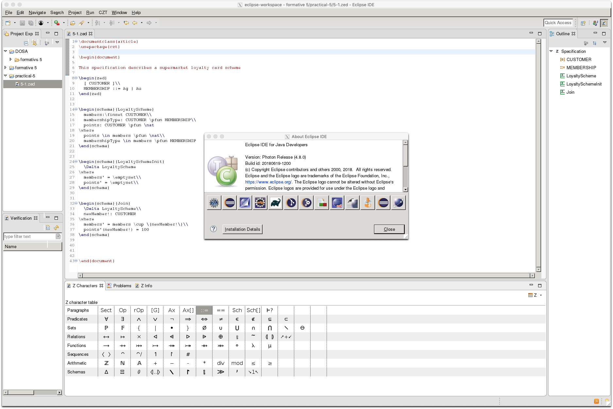

# docker-eclipse

Eclipse Photon (4.8.0) in a Docker container. I needed this to use a CZT plugin that did not work once I had upgraded to OSX Mojave.

## Requirements

* Docker 1.2+ (should work fine on 1.0+ but I haven't tried)
* An X11 socket

## Getting started

* Clone the repository and run `docker build -t eclipse .`
* Make sure XQuartz is installed, then go to Preferences > Security and enable 'Allow connections from network clients'
* Run `xhost + 127.0.0.1`

Eclipse plugins are kept on `$HOME/.eclipse` inside the container, we to share it with your
host so they persist..

* Create directories to share: `mkdir -p ${HOME}/.eclipse-docker`

Then start the container. 

```
docker run -ti --rm \
        -e DISPLAY=docker.for.mac.localhost:0 \
        -v /tmp/.X11-unix:/tmp/.X11-unix \
        -v ${HOME}/.eclipse-docker:/home/developer \
        -v ${HOME}:/workspace \
        eclipse:latest
```

If all goes well, you'll have eclipse running! 

